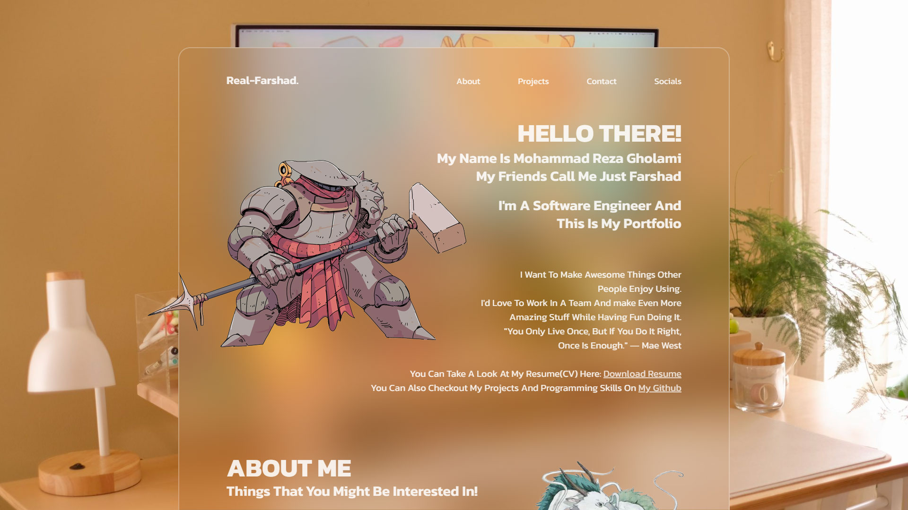
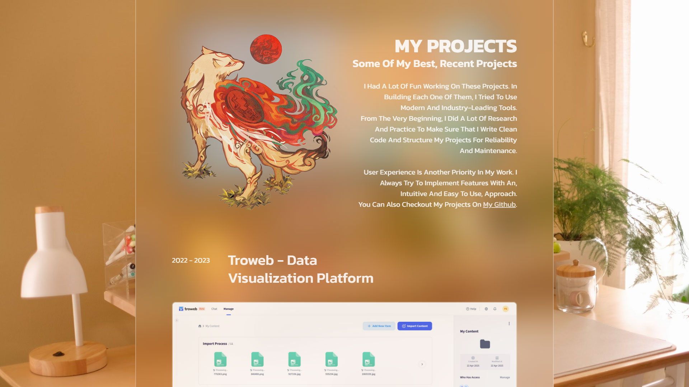
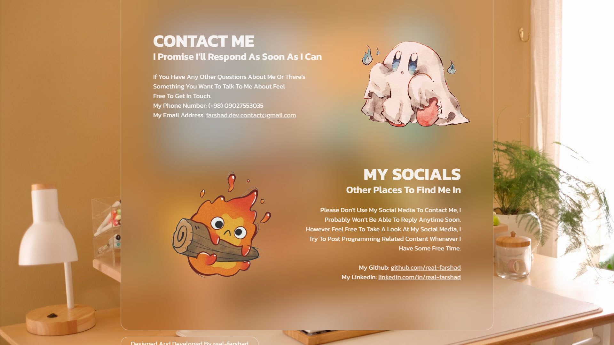

# Portfolio V1.0

Live demo: [real-farshad.vercel.app](https://real-farshad.vercel.app)

This is my single page, next.js, portfolio web application.I'm a software engineer and a full-stack web developer. In my portfolio website you can read about my experience, my skills, and some other related information about me. You can also check out my single page, pdf, [Resume](https://farshad-dev.vercel.app/Farshad_Resume.pdf).

## Technologies

- Javascript
- Next.js
- Sass

## Installation

1. Clone repository
2. Install dependencies: `npm install`
3. Start development: `npm run dev`

## Development Commands

- `npm run dev`: Start development server
- `npm run build`: Create production build
- `npm start`: Launch production server

Access via:

http://localhost:3000

## Screenshots

